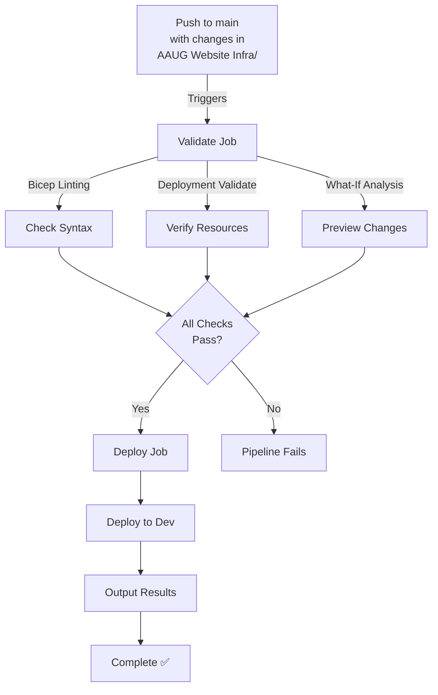
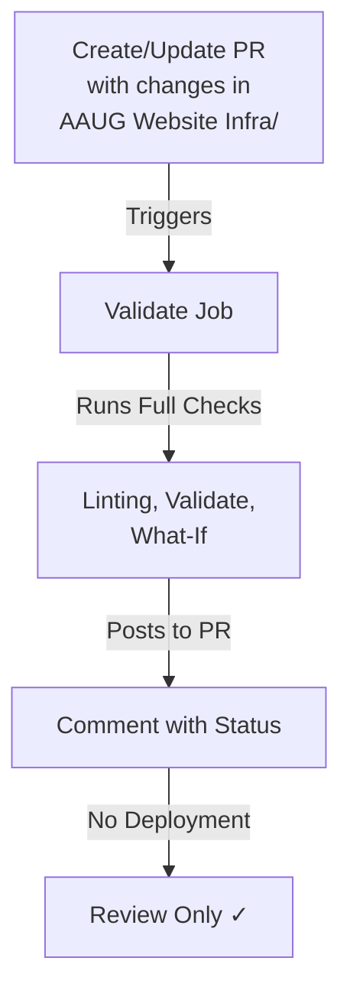

# AAUG Website Infrastructure CI/CD Pipeline

GitHub Actions workflow for automated deployment of Azure Static Website infrastructure.

## Overview

The **`deploy-website-infra.yml`** workflow automatically validates and deploys the AAUG Website Infrastructure when changes are pushed to the `main` branch or triggered manually.

## Workflow Features

✅ **Automatic Triggers**
- Fires on `git push` to `main` when files in `AAUG Website Infra/` change
- Runs on pull requests (validation only, no deployment)
- Manual trigger via GitHub Actions UI

✅ **Two-Stage Pipeline**
1. **Validate** — Linting, validation, What-If analysis (all triggers)
2. **Deploy** — Infrastructure deployment (push/manual only, not PRs)

✅ **Security**
- OIDC federated credentials (no secrets stored)
- Environment-based access controls
- GitHub Actions review approval for prod deployments

✅ **Concurrency Protection**
- Prevents simultaneous deployments to same environment
- Queues subsequent requests

## Prerequisites

### Azure Setup

1. **Create a Service Principal** with appropriate role:

```bash
az ad app create --display-name "GitHub-AAUG-Website" \
  --query objectId -o tsv
```

2. **Set up OIDC Federated Credentials**:

```bash
PRINCIPAL_ID=$(az ad app list --filter "displayName eq 'GitHub-AAUG-Website'" --query "[0].id" -o tsv)

# Federate with GitHub repository
az identity federated-credentials create \
  --id /subscriptions/{subscription-id}/resourcegroups/{rg-name}/providers/Microsoft.ManagedIdentity/userAssignedIdentities/{identity-name} \
  --parameters \
    issuer=https://token.actions.githubusercontent.com/ \
    subject="repo:{github-owner}/{github-repo}:ref:refs/heads/main" \
    audiences=api://AzureADTokenExchange
```

_Or use the provided `setup-sp.sh` script in the repository._

### GitHub Secrets Configuration

Add the following secrets to your GitHub repository:

**Settings → Secrets and variables → Actions**

| Secret Name | Value | Description |
|------------|-------|-------------|
| `AZURE_CLIENT_ID` | App (client) ID from Service Principal | Used for OIDC auth |
| `AZURE_TENANT_ID` | Directory (tenant) ID from Azure AD | Used for OIDC auth |
| `AZURE_SUBSCRIPTION_ID` | Azure subscription ID | Target subscription |

### GitHub Environments Configuration

Create environment protection rules in GitHub:

**Settings → Environments**

Create three environments:
1. **`dev`** — No approval required
2. **`staging`** — Require approval from release team
3. **`prod`** — Require approval from release team + multiple reviewers

```yaml
# Example for prod environment:
Required reviewers: 2+ team members
Deployment branches: main only
```

## How It Works

### On Push to Main



### On Pull Request



### Manual Trigger

Users can manually trigger via GitHub Actions UI:

1. Go to **Actions** tab
2. Select **Deploy AAUG Website Infrastructure**
3. Click **Run workflow**
4. Select environment (dev/staging/prod)
5. Optionally specify Azure region
6. Click **Run workflow**

## Workflow Stages

### Stage 1: Validate

**Runs on**: PRs, pushes, manual triggers
**Skips if**: Validation fails

```
📋 Validate & What-If
├── 🔍 Lint Bicep Templates
│   ├── main.bicep
│   ├── modules/staticWebApp.bicep
│   └── modules/storageAccount.bicep
├── 📋 Validate Deployment
│   └── Azure syntax and resource validation
├── 🔮 What-If Analysis
│   └── Preview all infrastructure changes
└── ✅ All Checks Pass
```

### Stage 2: Deploy

**Runs on**: Push to main, manual triggers (NOT PRs)
**Requires**: Validate stage to pass
**Needs**: Environment approval (if configured)

```
🚀 Deploy Infrastructure
├── 📦 Checkout Code
├── 🔐 Azure Login (OIDC)
├── 🔨 Set up Bicep CLI
├── 🚀 Deploy Resources
│   ├── Create Resource Group (aaug-website-rg)
│   ├── Deploy Static Web App
│   ├── Deploy Storage Account
│   └── Apply Tags & Configurations
├── 📊 Output Results
│   ├── Static Web App URL
│   ├── Storage Account Name
│   └── Deployment ID
└── ✅ Deployment Complete
```

## Outputs & Results

After successful deployment, the workflow displays:

```markdown
### 🎉 Deployment Outputs

**Environment**: dev
**Region**: australiaeast

#### Resource Outputs
- resourceGroupName: aaug-website-rg
- staticWebAppName: aaug-website-dev
- staticWebAppUrl: https://polite-flower-xxxx.australiaeast.azurestaticapps.net
- storageAccountName: staaugwebdev
- storageAccountWebEndpoint: https://staaugwebdev.z26.web.core.windows.net/

#### Deployment Details
- **Deployment ID**: `deploy-website-dev-1234567890`
- **Triggered by**: @username
- **Commit**: [abc123def]
```

## Triggering Deployments

### Automatic Trigger (Push to Main)

```bash
# Make changes to infrastructure
git checkout -b feature/add-cdn
# ... edit AAUG Website Infra files ...
git commit -m "Add CDN configuration to Static Web App"
git push origin feature/add-cdn

# Create PR → Validation runs
# Merge to main → Deploy runs
```

### Manual Trigger

1. Visit **Actions** → **Deploy AAUG Website Infrastructure**
2. Click **Run workflow**
3. Select environment and region
4. Click **Run workflow**

### Scheduled Deployments

To add scheduled deployments, update the workflow:

```yaml
on:
  schedule:
    - cron: '0 2 * * 0'  # Weekly Sunday 2 AM
```

## Troubleshooting

### Workflow Not Triggering

**Problem**: Push to main but workflow didn't run

**Solutions**:
1. Check file paths — changes must be in `AAUG Website Infra/`
2. Verify branch is `main`
3. Check workflow is enabled in Actions tab
4. Review git commit includes infrastructure files:
   ```bash
   git diff HEAD~1 --name-only | grep "AAUG Website Infra"
   ```

### Authentication Failure (OIDC)

**Problem**: `Error: AADSTS70025 or authentication failed`

**Solutions**:
1. Verify secrets configured correctly:
   - `AZURE_CLIENT_ID`
   - `AZURE_TENANT_ID`
   - `AZURE_SUBSCRIPTION_ID`

2. Check OIDC federation setup:
   ```bash
   az identity federated-credentials show \
     --resource-group <rg> \
     --identity-name <identity>
   ```

3. Run troubleshooting script:
   ```bash
   ./Azure\ Infrastructure/scripts/fix-federated-credentials.sh
   ```

### Bicep Validation Failure

**Problem**: `Lint validation failed`

**Solutions**:
1. Validate locally:
   ```bash
   az bicep lint AAUG\ Website\ Infra/main.bicep
   ```

2. Check parameter file matches template:
   ```bash
   az deployment sub validate \
     --location australiaeast \
     --template-file "AAUG Website Infra/main.bicep" \
     --parameters "@AAUG Website Infra/parameters/parameters.dev.json"
   ```

### Deployment Fails

**Problem**: Validation passed but deployment failed

**Solutions**:
1. Review deployment logs in GitHub Actions
2. Check Azure Portal for:
   - Quota limits
   - Resource naming conflicts
   - Permission issues
3. Run What-If locally to preview changes:
   ```bash
   az deployment sub what-if \
     --location australiaeast \
     --template-file "AAUG Website Infra/main.bicep" \
     --parameters "@AAUG Website Infra/parameters/parameters.dev.json"
   ```

### Approval Required

**Problem**: Workflow pending approval

**Solutions**:
1. Check GitHub **Actions** → deployment pending section
2. Required reviewers must approve in **Environments** settings
3. For prod: May require multiple approvals

## Modifying the Workflow

### Change Default Environment

Edit `env.LOCATION` or change trigger defaults:

```yaml
github.event.inputs.environment || 'staging'  # Changed from 'dev'
```

### Add Additional Linting Steps

```yaml
- name: Security scanning
  run: |
    az bicep lint --file "AAUG Website Infra/main.bicep"
    # Add security tools like checkov, tfsec, etc.
```

### Add Slack Notifications

```yaml
- name: Notify Slack
  uses: slackapi/slack-github-action@v1
  with:
    webhook-url: ${{ secrets.SLACK_WEBHOOK }}
    payload: |
      {
        "text": "Deployment Complete",
        "blocks": [
          {
            "type": "section",
            "text": {
              "type": "mrkdwn",
              "text": "AAUG Website deployed to ${{ github.event.inputs.environment }}"
            }
          }
        ]
      }
```

## Best Practices

1. **Review What-If Output** — Always check proposed changes before merging
2. **Test in Dev First** — Deploy to dev environment before staging/prod
3. **Approval Gate** — Require team approval for prod deployments
4. **Branch Protection** — Require PR reviews before merging to main
5. **Tag Releases** — Tag releases to track deployment versions:
   ```bash
   git tag -a v1.0.0 -m "Release website infrastructure v1.0.0"
   git push origin v1.0.0
   ```

## References

- [GitHub Actions Documentation](https://docs.github.com/actions)
- [Azure/login Action (OIDC)](https://github.com/azure/login#usage-with-openid-connect-oidc)
- [Azure Bicep Linting](https://learn.microsoft.com/azure/azure-resource-manager/bicep/linter)

---

**Last Updated**: 2026-04-07
**Workflow File**: `.github/workflows/deploy-website-infra.yml`
